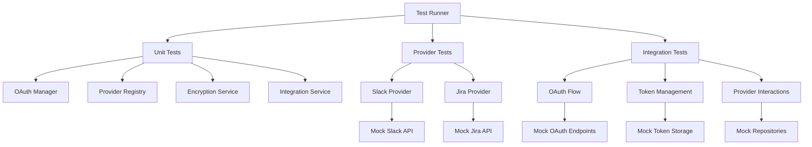
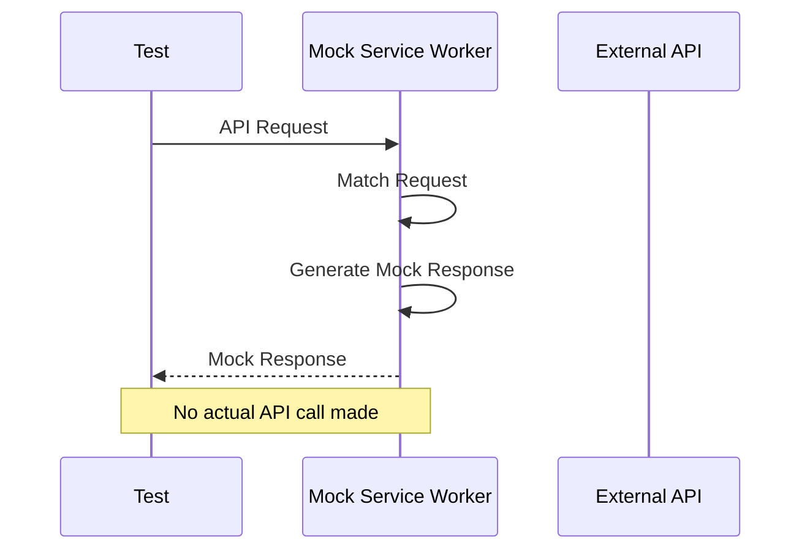

# Design Document

## Overview

This document outlines the design for implementing comprehensive unit and integration tests for the `@repo/integrations` package. The testing strategy will focus on ensuring the reliability, correctness, and security of the package's core components and provider implementations.

## Architecture

The testing architecture will follow a layered approach, with unit tests for individual components and integration tests for end-to-end functionality. We'll use Vitest as the testing framework, with MSW (Mock Service Worker) for API mocking and Vi-mock for dependency mocking.

### Testing Layers

1. **Unit Tests**: Test individual components in isolation with mocked dependencies
2. **Integration Tests**: Test interactions between components with mocked external dependencies
3. **End-to-End Tests**: Test complete flows with mock API responses

### Directory Structure

```
packages/integrations/
├── src/
│   └── ...
├── tests/
│   ├── setup.ts                 # Test setup file
│   ├── utils/                   # Test utilities
│   │   ├── mocks.ts             # Common mocks
│   │   ├── fixtures.ts          # Test fixtures
│   │   └── test-helpers.ts      # Helper functions
│   ├── unit/                    # Unit tests
│   │   ├── oauth-manager.test.ts
│   │   ├── provider.test.ts
│   │   ├── encryption.test.ts
│   │   └── ...
│   ├── providers/               # Provider-specific tests
│   │   ├── slack/
│   │   │   ├── provider.test.ts
│   │   │   └── api.test.ts
│   │   └── jira/
│   │       ├── provider.test.ts
│   │       └── api.test.ts
│   └── integration/             # Integration tests
│       ├── oauth-flow.test.ts
│       ├── token-management.test.ts
│       └── ...
└── vitest.config.ts             # Vitest configuration
```

## Components and Interfaces

### Test Setup

The `setup.ts` file will configure the testing environment, including:

- Setting up MSW for API mocking
- Configuring environment variables for testing
- Setting up test database if needed
- Configuring test timeouts and other global settings

### Mock Implementations

We'll create mock implementations for:

1. **External APIs**:
   - Slack API endpoints
   - Jira API endpoints
   - OAuth token endpoints

2. **Internal Dependencies**:
   - Database repositories
   - Encryption services
   - Token storage

3. **Test Providers**:
   - A test provider implementation for verification

### Test Fixtures

We'll create fixtures for:

1. **API Responses**:
   - OAuth token responses
   - Slack channel responses
   - Jira project responses
   - Error responses

2. **Input Data**:
   - OAuth callback parameters
   - Message data
   - Integration configurations

3. **Expected Outputs**:
   - Formatted messages
   - Encrypted tokens
   - OAuth states

## Data Models

### Test Configuration

```typescript
interface TestConfig {
  mockApiResponses: boolean;
  useInMemoryDb: boolean;
  logLevel: 'error' | 'warn' | 'info' | 'debug';
}
```

### Mock Provider

```typescript
class MockProvider extends BaseIntegrationProvider {
  readonly name = 'mock';
  readonly type = 'test';
  readonly displayName = 'Mock Provider';
  
  // Implementation of required methods with tracking for verification
  getAuthUrl: vi.Mock;
  handleCallback: vi.Mock;
  refreshToken: vi.Mock;
  getAvailableChannels: vi.Mock;
  postMessage: vi.Mock;
}
```

### Test Repository

```typescript
class TestIntegrationRepository implements IntegrationRepository {
  private integrations: Map<string, Integration>;
  
  // Implementation of repository methods with in-memory storage
}
```

## Error Handling

The test suite will include specific tests for error scenarios:

1. **OAuth Errors**:
   - Invalid state
   - Expired state
   - Authorization errors
   - Token exchange errors

2. **API Errors**:
   - Rate limiting
   - Authentication failures
   - Permission errors
   - Network errors

3. **Validation Errors**:
   - Invalid configurations
   - Missing required fields
   - Format validation errors

## Testing Strategy

### Unit Testing

Unit tests will focus on testing individual components in isolation:

1. **OAuth Manager**:
   - State generation and validation
   - Token refresh logic
   - Error handling

2. **Provider Registry**:
   - Provider registration
   - Provider retrieval
   - Type filtering

3. **Encryption Service**:
   - Token encryption
   - Token decryption
   - Error handling

4. **Integration Service**:
   - OAuth flow initiation
   - Callback handling
   - Provider interaction

### Provider Testing

Provider tests will focus on the specific implementations:

1. **Slack Provider**:
   - OAuth URL generation
   - Token exchange
   - Channel retrieval
   - Message posting

2. **Jira Provider**:
   - OAuth URL generation
   - Token exchange
   - Project retrieval
   - Issue creation

### Integration Testing

Integration tests will verify end-to-end functionality:

1. **Complete OAuth Flow**:
   - From authorization to token storage
   - With mock API responses

2. **Provider Interactions**:
   - Channel retrieval and message posting
   - With mock API responses

3. **Error Handling**:
   - Recovery from API errors
   - Retry logic

## Mermaid Diagrams

### Test Architecture



### Mock Service Worker Setup



## Security Considerations

1. **Test Environment Security**:
   - No actual API credentials in tests
   - No actual API calls to external services
   - Secure handling of test fixtures

2. **Coverage of Security Features**:
   - Comprehensive testing of encryption
   - Testing of CSRF protection
   - Testing of token security

3. **Sensitive Data Handling**:
   - No real tokens or credentials in test fixtures
   - Proper cleanup of test data