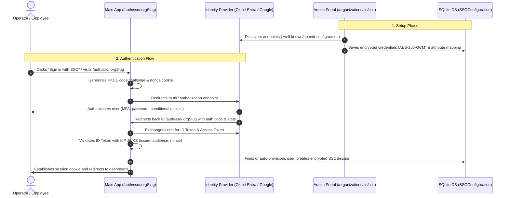

# Single Sign-On (SSO) with OpenID Connect (OIDC)

Epic Stack includes built-in, enterprise-grade Single Sign-On (SSO) powered by **OpenID Connect (OIDC)** and OAuth 2.0. Organizations can connect their central Identity Providers (IdP)—such as Okta, Microsoft Entra ID (Azure AD), Google Workspace, Auth0, Ping Identity, or Keycloak—to seamlessly authenticate operators and team members.

---

## Overview & Architecture

Epic Stack's SSO architecture separates control-plane authentication from tenant data planes, adhering to high security and strict protocol standards:

---

## Key Features

<CardGroup cols={2}>
  <Card title="OIDC Auto-Discovery" icon="compass">
    Automatically discovers authorization, token, userinfo, revocation, and JWKS endpoints from `/.well-known/openid-configuration`.
  </Card>
  <Card title="PKCE & Cryptographic Security" icon="shield-check">
    Enforces PKCE (RFC 7636) with SHA-256 code challenge method, secure nonce cookies against replay attacks, and AES-256-GCM encryption for stored secrets.
  </Card>
  <Card title="Just-in-Time (JIT) Provisioning" icon="user-plus">
    Automatically provisions new users upon successful SSO authentication, or links existing users by email with customizable default roles.
  </Card>
  <Card title="Flexible Attribute Mapping" icon="arrows-split-up-and-left">
    Map standard or custom IdP claims (`sub`, `email`, `name`, `preferred_username`, `groups`) to Epic Stack profile fields.
  </Card>
</CardGroup>

---

## Admin Portal Configuration

Admins can configure SSO for any organization via the Admin Portal at:
`https://admin.epic-startup.me:2999/organizations/{organizationId}/sso`

### Step-by-Step Setup

1. **Navigate to the Organization**: Open the Admin dashboard, find the target organization, and go to **SSO Configuration**.
2. **Enter Identity Provider Details**:
   - **Provider Name**: Select provider (e.g. `Okta`, `Microsoft Entra ID`, `Google Workspace`, `Auth0`, or `Custom`).
   - **Issuer URL**: The base URL of the IdP (e.g. `https://your-org.okta.com` or `https://login.microsoftonline.com/{tenantId}/v2.0`).
   - **Client ID**: The OAuth2 Client ID registered in your IdP application.
   - **Client Secret**: The client secret generated by your IdP (stored encrypted).
   - **Scopes**: Default is `openid email profile`.
3. **Test Connection**: Click **Test Connection**. The server will fetch and validate the IdP's OIDC discovery document and test endpoint reachability.
4. **Configure Provisioning & Security Policies**:
   - **Auto-Provision Users**: Enable to allow new employees to log in without prior manual account creation.
   - **Default Role**: Select the default organization role (`member`, `admin`, etc.) assigned on first login.
   - **Require Verified Email**: Reject tokens if `email_verified` is not `true`.
   - **Allowed Email Domains**: Restrict logins to corporate domains (e.g., `acme.corp, example.com`).
   - **Enforce SSO**: Require all members of the organization to log in via SSO.
5. **Save & Enable**: Save the configuration and toggle **Enable SSO**.

---

## Common Provider Setup Guides

<Tabs>
  <Tab title="Okta">
    1. Go to **Okta Admin Console** -> **Applications** -> **Applications** -> **Create App Integration**.
    2. Choose **OIDC - OpenID Connect** -> **Web Application**.
    3. Configure:
       - **Sign-in redirect URI**: `https://your-domain.com/auth/sso/{org-slug}`
       - **Assignments**: Assign to groups or individuals in Okta.
    4. Copy the **Client ID**, **Client Secret**, and **Okta domain** (e.g., `https://dev-123456.okta.com`) into Epic Stack Admin SSO settings.
  </Tab>
  <Tab title="Microsoft Entra ID (Azure AD)">
    1. In **Azure Portal** / **Entra admin center**, go to **App registrations** -> **New registration**.
    2. Set Redirect URI type to **Web** and value to `https://your-domain.com/auth/sso/{org-slug}`.
    3. Under **Certificates & secrets**, generate a **New client secret**.
    4. Under **Overview**, copy:
       - **Application (client) ID** -> Client ID
       - **Directory (tenant) ID** -> Issuer URL will be `https://login.microsoftonline.com/{tenantId}/v2.0`
  </Tab>
  <Tab title="Google Workspace">
    1. In **Google Cloud Console**, go to **APIs & Services** -> **Credentials** -> **Create Credentials** -> **OAuth Client ID**.
    2. Select Application Type **Web application**.
    3. Add Authorized Redirect URI: `https://your-domain.com/auth/sso/{org-slug}`.
    4. Set Issuer URL in Epic Stack to `https://accounts.google.com`.
    5. Enter the **Client ID** and **Client Secret**.
  </Tab>
  <Tab title="Auth0">
    1. In **Auth0 Dashboard**, create a **Regular Web Application**.
    2. Set **Allowed Callback URLs**: `https://your-domain.com/auth/sso/{org-slug}`.
    3. Set Issuer URL to `https://{your-tenant}.auth0.com/`.
    4. Copy **Client ID** and **Client Secret** into Epic Stack.
  </Tab>
</Tabs>

---

## Attribute Mapping

By default, Epic Stack automatically extracts standard OIDC claims:

| Field | Standard OIDC Claim | Description |
| :--- | :--- | :--- |
| **Email** | `email` | User's primary email address (required) |
| **Name** | `name` (or `given_name` + `family_name`) | User's full display name |
| **Username** | `preferred_username` or `sub` | Unique username / handle |
| **Email Verified** | `email_verified` | Verification status boolean |

You can customize claim keys using the **Attribute Mapping** JSON field in the SSO configuration form if your provider uses non-standard claim names.

---

## Security & Compliance

- **Zero Cleartext Credentials**: Client secrets and session tokens are encrypted using AES-256-GCM via the `SSO_ENCRYPTION_KEY`.
- **SSRF Protection**: Discovery and endpoint URLs are validated against private IP blocks and internal networks before outgoing requests are made.
- **Audit Logging**: Every SSO operation—configuration changes, test attempts, successful authentications, and failed logins—is recorded in the HMAC-protected audit log.
- **Token Verification**: ID Tokens are cryptographically verified using IdP JWKS public keys with strict audience and clock-skew validation.
