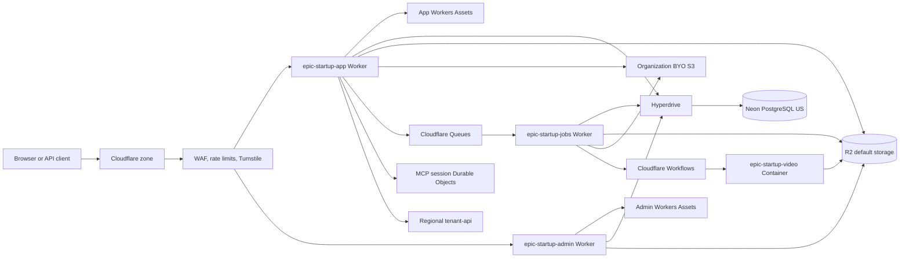

# App and Admin Migration from Fly.io to Cloudflare

## Summary

Move `apps/app`, `apps/admin`, the US control-plane database, background jobs,
default object storage, and edge security from Fly.io and Trigger.dev to
Cloudflare. Use Cloudflare Workers for React Router, Neon PostgreSQL through
Hyperdrive for relational data, R2 for default object storage, Workflows and
Queues for asynchronous work, and Cloudflare Containers for FFmpeg. Preserve
the regional customer-PII architecture. This specification builds on
[triage PR #358](https://github.com/mohammedzamakhan/epic-startup/pull/358).
The database starts empty; this migration does not copy SQLite rows.

This document is the implementation contract. An implementer must complete the
phases in order and must not pass a phase exit gate with a known failure.

## Product behavior

1. Existing App and Admin URLs, routes, redirects, response codes, cookies,
   authentication flows, authorization checks, and API contracts continue to
   work after cutover.
2. PostgreSQL starts empty and receives schema plus approved seed data. The
   cutover does not copy users, sessions, or other SQLite rows.
3. Existing uploads remain available under the same object keys and public
   URLs. New default-storage uploads use R2.
4. Organizations with a stored `OrganizationS3Config` continue to use their
   configured S3-compatible provider. The migration does not copy their
   objects to R2.
5. Each of the seven Trigger.dev tasks keeps its current trigger behavior,
   observable status, retry safety, and terminal database state.
6. Notification SSE and MCP Streamable HTTP remain available on the first
   production release.
7. Interactive authentication forms require a valid Turnstile result in
   production. API clients and OAuth callbacks do not receive an interactive
   challenge.
8. Cutover and rollback are DNS or route switches because the application has
   no live users or production data at cutover.
9. `apps/tenant-api`, `packages/tenant-db`, and the OCI customer-PII data plane
   do not change.

## Scope

### In scope

- `apps/app` and `apps/admin` Worker entry points, builds, static assets, and
  custom domains.
- `packages/database` conversion from SQLite to PostgreSQL.
- The shared US control-plane data currently stored in LiteFS.
- The shared cache implementation used by App and Admin.
- The seven tasks in `packages/background-jobs/src/tasks`.
- Default Tigris-compatible object storage and the R2 runtime binding.
- Per-organization BYO S3 compatibility.
- Cloudflare WAF, rate-limiting rules, and Turnstile integration.
- MCP session coordination and notification SSE.
- Observability, CI/CD, cutover, rollback, and Fly retirement.
- All 111 environment keys inventoried in Appendix A.

### Out of scope

- `apps/tenant-api`, `packages/tenant-db`, OCI VMs, regional tenant SQLite
  files, customer phone OTP, and customer JWTs.
- Changes to `docs/tenant-data-residency.md` or ADR 045.
- Moving `apps/web`, `apps/sites`, or `apps/cms`; they already run on
  Cloudflare.
- Cross-region customer-PII migration.
- Replacing Neon with D1.
- Replacing FFmpeg with a different transcoder.
- Moving organization-owned BYO S3 objects.
- A new notification protocol. SSE remains the public protocol.
- A new MCP protocol version. Preserve protocol `2025-11-25` and the current
  legacy compatibility behavior.
- Product redesigns unrelated to runtime compatibility.

## Target architecture



Deploy four independently versioned services:

1. `epic-startup-app`: React Router request handling, App static assets,
   notification SSE, MCP HTTP endpoints, R2, Hyperdrive, queues, and MCP
   Durable Objects.
2. `epic-startup-admin`: React Router request handling, Admin static assets,
   R2, and Hyperdrive.
3. `epic-startup-jobs`: Queue consumers, Workflow definitions, and three Cron
   Triggers. It binds Hyperdrive, R2, Images, and the video-container service.
4. `epic-startup-video`: a Worker-managed Cloudflare Container boundary. Its
   Linux image contains the pinned FFmpeg binary and only the code required to
   read an R2 input, transcode it, and write an R2 output.

Create independent staging and production instances of every stateful
resource:

- Neon database and branch/project credentials.
- Hyperdrive configuration.
- R2 bucket.
- Queue and dead-letter queue.
- Workflow names.
- Durable Object namespaces.
- Cloudflare custom domains and zone rules.

Do not share staging state with production.

## Technical design

### 1. React Router on Workers

Replace both Node/Express servers:

- `apps/app/server/index.ts`
- `apps/app/server/app.ts`
- `apps/admin/server/index.ts`
- `apps/admin/server/app.ts`

Add one Worker entry module per application. Each entry module must:

1. Import `createRequestHandler`, `createContext`, and
   `RouterContextProvider` from `react-router`.
2. Load `virtual:react-router/server-build`.
3. Create one typed `cloudflareContext` definition at module scope.
4. Create a new `RouterContextProvider` for each request.
5. Create request-scoped runtime services from bindings and set `{ env, ctx,
   services }` on `cloudflareContext`.
6. Pass the context provider to the request handler.
7. Return a Fetch API `Response`.
8. Export Durable Object classes from the App entry module.

The intended adapter shape is:

```ts
export const cloudflareContext = createContext<CloudflareContext>()
const requestHandler = createRequestHandler(
  () => import('virtual:react-router/server-build'),
  import.meta.env.MODE,
)

export default {
  async fetch(request, env, ctx) {
    const routerContext = new RouterContextProvider()
    routerContext.set(cloudflareContext, {
      env,
      ctx,
      services: createRequestServices(env),
    })
    return requestHandler(request, routerContext)
  },
} satisfies ExportedHandler<Env>
```

Loaders and actions obtain the value with
`context.get(cloudflareContext)`. Do not restore an untyped global load-context
object.

Use the Cloudflare Vite plugin for local Worker-runtime parity. Build output is
`build/server/index.js` plus `build/client`. Configure Workers Assets with
`run_worker_first: false` so matching immutable assets do not invoke SSR.

Replace Express and Node behavior as follows:

| Current behavior | Worker behavior |
| --- | --- |
| `app.listen()` and process signals | Module Worker `fetch()` export; no listener or shutdown hook |
| Express middleware chain | Composed functions around the React Router request handler |
| `express.static` and filesystem reads | Workers Assets binding |
| `compression` | Cloudflare automatic compression; preserve explicit cache headers |
| `express-rate-limit` | Cloudflare zone rate-limit rules |
| `fly-client-ip` | Validated `CF-Connecting-IP`; never trust client-supplied forwarding headers |
| Mutable Node response headers | Create a new `Response` with copied headers |
| `setImmediate()` | `ctx.waitUntil()` for bounded post-response work |
| Startup `setInterval()` | Cron Trigger, Queue, Workflow, or Durable Object alarm |
| `process.env` in request code | Typed `env` bindings passed through React Router context |
| Local filesystem state | PostgreSQL, R2, or Durable Object storage |
| Node-only request/response types | Fetch `Request`, `Response`, and `ReadableStream` |

Keep `nodejs_compat` enabled because Prisma's PostgreSQL adapter and `pg`
require it. Do not use the flag to preserve APIs that have native Worker
replacements.

Add a Worker compatibility test that imports each server bundle in
Miniflare/Vitest. The test fails on unsupported Node built-ins, top-level
filesystem access, listener creation, or unbound environment access.

### 2. Runtime dependency injection

Stop importing a process-global `prisma` instance in Worker request code.
Change `packages/database/db.server.ts` to expose a factory whose input is a
connection string. Store the resulting client in the request context.

The intended interface shape is:

```ts
export function createPrismaClient(connectionString: string): PrismaClient
```

Use this configuration:

- Keep Prisma at the repository-pinned `6.19.2` for the migration.
- Set the Prisma datasource provider to `postgresql`.
- Set `engineType = "client"`.
- Add `@prisma/adapter-pg` and a Hyperdrive-compatible `pg` release.
- In Workers, construct the adapter from
  `env.HYPERDRIVE.connectionString`.
- In Prisma CLI, CI, baseline, and seed utilities, use the direct unpooled
  Neon `DATABASE_URL`.
- Do not use Neon's pooled hostname or the Neon serverless driver behind
  Hyperdrive. Hyperdrive is the pool.
- Create a client for each request or Workflow step. Disconnect or release it
  in `finally`.

Pass the database service through React Router context and update package
interfaces that currently import the singleton. A temporary compatibility
adapter is allowed only in Node test processes. Production Worker code must
not read `DATABASE_URL`.

### 3. PostgreSQL and Hyperdrive

Use Neon PostgreSQL in a US region. Create separate staging and production
databases. Keep the provider replaceable by using standard PostgreSQL,
standard `pg`, Prisma migrations, and no Neon-specific SQL in application
paths.

Create Hyperdrive from Neon's direct, unpooled connection string. Disable
Hyperdrive query caching at launch. Authentication, authorization, sessions,
billing, audit data, and job status cannot tolerate an accidentally cached
read. Re-evaluate query caching only after every candidate query has an
explicit staleness and invalidation contract.

Hyperdrive configuration values are resource IDs, not secrets. The Neon
credential is stored in the Hyperdrive configuration. `DATABASE_URL` remains a
secret available only to migration and CI jobs.

Enable Smart Placement for App and Admin. Measure p50 and p95 end-to-end
latency from the primary user geographies before and after enabling it. Keep it
only when it improves dynamic-route latency without regressing asset delivery;
Workers Assets remain asset-first.

Do not configure Smart Placement on the Jobs Worker. Cloudflare placement
affects `fetch` handlers, not Queue, Cron, or Workflow entrypoints.

### 4. SQLite-to-PostgreSQL schema conversion

#### 4.1 Schema conversion

The existing 56 SQLite migration directories are historical artifacts. Do not
run them against PostgreSQL. There is no production data to copy.

1. Tag the last SQLite production schema commit.
2. Preserve the 56 migrations in an explicitly named SQLite archive with a
   README that states they cannot run against PostgreSQL.
3. Change `packages/database/schema.prisma` to `provider = "postgresql"`.
4. Generate one squashed PostgreSQL baseline migration from the full Prisma
   schema. A squash is preferred because no deployed data or migration state
   must be preserved.
5. Review the generated SQL before applying it.
6. Apply the baseline with `prisma migrate deploy` to empty staging and
   production Neon databases through the direct `DATABASE_URL`.
7. Run the existing seed path after the migration. Make the seed path
   deterministic and safe to rerun, or document that it must run exactly once.

The baseline must include the current 58 Prisma models plus the new
`CacheEntry` model, all enums, all indexes, all foreign keys, and all implicit
many-to-many join tables.

Review these conversions explicitly:

- SQLite integer booleans become PostgreSQL `boolean`.
- SQLite date/time representations become PostgreSQL `timestamp(3)` using UTC.
- `Bytes` columns become `bytea`.
- JSON serialized into `String` remains text unless a separate application
  change and compatibility test justifies `jsonb`.
- IDs remain their current string format. Do not replace IDs with sequences.
- Unique indexes preserve case-sensitive semantics. Test every identity and
  slug lookup against mixed-case input.
- Empty strings remain empty strings. Do not silently convert them to `NULL`.
- Foreign-key delete/update actions match the Prisma schema.
- Self-relations and implicit many-to-many tables are created correctly by the
  baseline.
- Seed inserts respect foreign-key dependency order.

#### 4.2 Schema validation

Do not build SQLite export, PostgreSQL import, reconciliation, dual-write, or
reverse-export tooling. Those systems would solve a data-preservation problem
that does not exist for this cutover.

Validate the schema on a fresh PostgreSQL database:

1. Start with an empty PostgreSQL database.
2. Run `prisma migrate deploy`.
3. Run the existing seed path.
4. Run `prisma migrate diff` or an equivalent schema comparison and require no
   drift from `schema.prisma`.
5. Verify all 59 Prisma models, enums, indexes, foreign keys, and implicit join
   tables exist.
6. Run the repository database tests against PostgreSQL.
7. Sign in with a seeded account and create, update, and delete an
   organization-scoped record.
8. Verify invitations, memberships, roles, permissions, Stripe webhook
   idempotency, audit-chain integrity, MCP tokens, and rate-limit rows.
9. Verify App and Admin use the same PostgreSQL database.

Session continuity is not a cutover requirement because there are no live
users or sessions. Keep the existing cookie and secret behavior for the
production-grade target, but do not add session-copy logic.

### 5. Shared cache

Do not move the generic cache to Workers KV. KV is eventually consistent and a
value can remain stale in another location for approximately 60 seconds. The
current cache includes user and security keys, so that behavior is unsafe.

Replace the SQLite durable cache with a PostgreSQL-backed cache adapter behind
the existing `@repo/cache` interface:

- Add `CacheEntry` with `key`, serialized `value`, optional serialized
  `metadata`, `createdAt`, `expiresAt`, and byte `size`.
- Use a unique primary key on `key` and an index on `expiresAt`.
- Make `set`, `delete`, and `clear` immediately visible through PostgreSQL.
- Treat serialization as untrusted input and preserve the existing safe
  serializer contract.
- Delete expired entries opportunistically and in a daily Jobs cleanup.
- Do not migrate `cache.db`; cache data is disposable.

Keep the in-process LRU as an optional isolate-local first level. It must never
be the sole source for sessions, authorization, revocation, rate limits, or
security configuration. Every mutation invalidates the local entry in the
current isolate; bounded TTL handles other isolates.

Update the Admin cache UI:

- Replace SQLite/Fly instance terminology with `Shared PostgreSQL cache` and
  `Current isolate LRU`.
- Preserve shared-cache key search, stats, single-key deletion, and clear.
- State that current-isolate LRU statistics do not represent all isolates.
- Remove Fly machine/instance selection because Workers isolates cannot be
  enumerated.

### 6. Object storage

#### 6.1 Default storage

Use an R2 binding for default storage in Workers. Refactor `packages/storage`
so the application depends on a provider interface with two adapters:

- `R2BindingStorageProvider` for the platform default.
- Existing S3-compatible provider for organization BYO S3.

The R2 adapter uses native `R2Bucket` methods in Worker code. Do not pass R2
access keys to App or Admin Workers. Migration scripts may use R2's
S3-compatible endpoint with narrowly scoped credentials.

For objects larger than one safe request part, expose authenticated multipart
upload endpoints in the App Worker:

1. Create the multipart upload through the R2 binding and persist the upload
   ID, organization, owner, key, size limit, and expiry in PostgreSQL.
2. Accept one numbered part per request. Keep every part below the active
   Cloudflare zone body limit and stream it to `uploadPart`.
3. Reject an expired upload, a key/owner mismatch, duplicate conflicting part,
   unsupported content type, or total size above the application limit.
4. Complete only after the client submits the ordered part/ETag manifest and
   the server verifies it.
5. Abort expired multipart uploads from a scheduled Jobs cleanup.

This flow keeps R2 credentials out of the browser and Worker secrets. It also
supports objects larger than one Cloudflare request without buffering.

Preserve:

- Object key.
- Content type.
- Cache control.
- Content disposition.
- Custom metadata used by the application.
- ETag/checksum evidence in the storage migration manifest.

Use a production custom domain for public R2 content. Do not use `r2.dev` in
production.

#### 6.2 Tigris-to-R2 migration

1. Inventory Tigris object count, total bytes, key prefixes, metadata, and
   object-size distribution.
2. Create staging and production R2 buckets.
3. Run an initial `rclone` copy before cutover.
4. Compare count and total bytes. Hash every object when the source exposes a
   compatible checksum; otherwise hash all objects below a configurable size
   and a statistically significant sample of larger objects by streaming.
5. Verify that default storage has no live writes.
6. Run a final delta sync immediately before DNS cutover and repeat validation.
7. Change Fly's default S3 configuration to R2 before Worker DNS cutover.
   This makes DNS rollback use the same object store.
8. Keep Tigris read-only for 30 days after cutover.
9. Delete Tigris only after the rollback period and written approval.

Do not copy organization-owned BYO S3 buckets. Preserve
`OrganizationS3Config`, credential encryption, endpoint validation, SSRF
protection, and provider-specific path-style behavior.

### 7. Background jobs

Replace `packages/background-jobs/src/client.ts` with a platform-neutral
dispatcher. Interactive requests enqueue a small identifier-only payload.
Payloads must not contain credentials, full files, or customer PII.

Every task uses a deterministic idempotency key. Persist its job ID, attempt,
state, timestamps, and last error in PostgreSQL. A Workflow step may retry
without repeating an irreversible side effect.

#### 7.1 Video processing

Source: `packages/background-jobs/src/tasks/video-processing.ts`.

- Producer: `VIDEO_JOBS` Queue.
- Consumer: creates a `VideoProcessingWorkflow`.
- Workflow steps:
  1. Claim the database record with an idempotent state transition.
  2. Resolve the default R2 object or organization BYO S3 object.
  3. Copy a BYO S3 source to a temporary R2 key when the Container cannot
     securely access the source directly.
  4. Call `VIDEO_SERVICE` with the job ID. The Video Worker validates the
     internal request and invokes the named `VideoContainer` instance.
  5. Stream input and output. Do not buffer media in the Worker.
  6. Validate output metadata and checksum.
  7. Move/copy the final object to its stable key.
  8. Mark success atomically.
  9. Remove temporary objects in success and compensating cleanup paths.
- Container: `linux/amd64`, pinned FFmpeg version, no database credential,
  least-privilege R2 access through its controlling Worker.
- Retry: exponential, maximum five Workflow step attempts for transient
  storage/container errors.
- Terminal failure: preserve the source, mark the database record failed, and
  expose the last safe retry point.

#### 7.2 Image processing

Source: `packages/background-jobs/src/tasks/image-processing.ts`.

- Producer: `IMAGE_JOBS` Queue.
- Consumer: `ImageProcessingWorkflow`.
- Read the source as a stream from R2 or BYO S3.
- Use the Images binding for input up to 20 MB.
- Use the same deterministic transform parameters and output key as today.
- For input over 20 MB, fail with a typed `IMAGE_INPUT_TOO_LARGE` status on the
  first release. Do not silently reduce quality or route it to FFmpeg.
- Write the transformed stream to the destination provider.
- Validate content type and output dimensions before success.

#### 7.3 Cross-account storage transfer

Source: `packages/background-jobs/src/tasks/transfer-s3-files.ts`.

- Trigger: `TRANSFER_JOBS` Queue.
- Consumer: `CrossAccountTransferWorkflow`.
- Page source keys and process bounded batches.
- Stream each object source-to-destination.
- Persist a checkpoint after a destination checksum/metadata verification.
- Delete a source object only after destination verification and a durable
  checkpoint.
- Preserve BYO S3 endpoint, region, key layout, and metadata.
- A retry resumes from the last checkpoint and skips verified objects.

#### 7.4 Audit integrity backfill

Source: `packages/background-jobs/src/tasks/audit-integrity-backfill.ts`.

- Trigger: authenticated Admin action creates
  `AuditIntegrityBackfillWorkflow`.
- Process stable primary-key ranges.
- Persist the last completed range.
- Recompute and verify chain data without overwriting a conflicting existing
  value.
- Record an audit event for start, completion, failure, and manual cancel.
- Permit only one active backfill per target scope.

#### 7.5 Audit archival

Source: `packages/background-jobs/src/tasks/audit-log-archival.ts`.

- Cron: `0 2 * * *` UTC.
- Scheduled handler creates one `AuditArchivalWorkflow` with a date-derived
  deterministic ID.
- Select eligible records using the current retention policy.
- Write a versioned, compressed archive to R2.
- Verify archive row count and checksum.
- Delete database rows only after verification.
- A rerun for the same date returns the existing successful instance.

#### 7.6 MCP token cleanup

Source: `packages/background-jobs/src/tasks/mcp-token-cleanup.ts`.

- Cron: `0 3 * * *` UTC.
- Run in the scheduled Jobs handler; a Workflow is unnecessary for the bounded
  database delete.
- Delete expired/revoked token rows in bounded batches.
- Emit deleted-row count, duration, and failure metrics.
- Use a PostgreSQL advisory lock so only one cleanup runs.

#### 7.7 GDPR erasure

Source: `packages/background-jobs/src/tasks/gdpr-erasure.ts`.

- Cron: `0 4 * * *` UTC discovers due requests.
- Create one `GdprErasureWorkflow` per request ID.
- Keep the current legal hold, grace period, and audit requirements.
- Use one idempotent step per data domain.
- Record completion evidence that contains identifiers and counts, not erased
  personal data.
- Retry transient failures. A permanent failure leaves the request visible for
  operator intervention and does not report completion.

Configure dead-letter queues for video, image, and transfer messages. Alert on
any dead-letter message. A dead-letter replay must retain the original
idempotency key.

### 8. MCP Streamable HTTP

The current in-memory `Map` loses sessions when a process restarts and cannot
coordinate Workers isolates. Replace it with one SQLite-backed Durable Object
per `MCP-Session-Id`.

The Durable Object must:

1. Store session ID, user ID, organization ID, protocol version, created time,
   and last activity time.
2. Validate user and organization ownership on every request.
3. Serialize requests for one session.
4. Refresh a 30-minute alarm after valid activity.
5. Delete all session storage on HTTP `DELETE` or alarm expiry.
6. Return the same response codes and MCP headers as the existing handler.
7. Preserve JSON/SSE content negotiation, origin validation, legacy transport
   behavior, and protocol `2025-11-25`.
8. Store no OAuth provider secret or access token in Durable Object storage.

Route a validated MCP request from the App Worker to
`env.MCP_SESSIONS.getByName(sessionId)`. The object can call back into
application services through explicit parameters or a service binding; it must
not import a global Prisma client.

### 9. Notification SSE

Keep the existing HTTP SSE API and native `ReadableStream` implementation on
day one.

- Preserve heartbeat cadence, event shape, authentication, reconnection
  behavior, and cancellation cleanup.
- Stop polling when the request signal aborts.
- Bound each database poll.
- Do not buffer the stream.
- Track concurrent streams, p50/p95 delivery latency, disconnect rate,
  duration, database queries per stream-minute, isolate errors, and memory
  failures.

Gate production on a load test at the observed production peak plus 50%.
Acceptance thresholds:

- No Worker memory or CPU-limit errors.
- Fewer than 0.5% unexpected disconnects over a 30-minute run.
- p95 event delivery latency below two heartbeat intervals.
- Database query rate stays within the approved Neon capacity.

If the test fails, add organization-scoped Durable Object WebSocket fan-out
using the Hibernation API. That fallback is an implementation phase gate, not
permission to remove SSE from the public API.

### 10. Security controls

#### 10.1 Arcjet replacement

Remove `ARCJET_KEY`, `@arcjet/node`, and
`packages/security/src/arcjet.server.ts` only after equivalent Cloudflare rules
are active in staging.

Use:

- Cloudflare managed WAF rules.
- Zone custom rules in phase `http_request_firewall_custom`.
- Zone rate-limit rules in phase `http_ratelimit`.
- Turnstile with mandatory server-side Siteverify.
- Existing application authorization, CSRF/honeypot, encryption, audit
  logging, and security headers.

Infrastructure code must use the Rulesets API or the repository's chosen IaC
provider. Export the resulting ruleset IDs and versions to deployment
artifacts.

The deployment code must manage zone entrypoint rulesets as follows:

1. Read the current entrypoint ruleset before changing it.
2. Enable the approved managed WAF rules in
   `http_request_firewall_managed`.
3. Create or update repository-owned custom rules in
   `http_request_firewall_custom`.
4. Create or update repository-owned rate-limit rules in `http_ratelimit`.
5. Give every owned rule a stable description prefix and immutable logical
   ID in source control.
6. Update the complete ruleset in one operation. Preserve rules that do not
   carry the repository prefix.
7. Store the pre-change ruleset JSON as a deployment artifact.
8. Roll back security configuration by restoring that artifact, not by
   deleting the entrypoint ruleset.

Each rate-limit resource must define its route/method expression, counting
characteristics, period, requests per period, action, and mitigation timeout.
Use IP-based characteristics unless an approved zone plan and privacy review
allow another characteristic. Generate numeric thresholds from the current
application constants and checked-in policy. Do not place placeholder or
guessed thresholds in production IaC.

Create path-specific rate-limit rules from existing application constants.
Do not invent weaker limits. At minimum cover:

- Login, signup, password reset, email verification, 2FA, recovery, and
  waitlist submission.
- OAuth authorization and token endpoints.
- MCP SSE connection and tool invocation.
- Webhooks by provider and path.
- Upload initiation and expensive media operations.
- Admin authentication.

Preserve the database-backed, fail-closed MCP OAuth limits in
`apps/app/app/utils/rate-limit.server.ts` because they are identity-aware.
Cloudflare rate limiting is an outer abuse-control layer, not a replacement for
that transactional control.

#### 10.2 Turnstile

Render Turnstile on interactive login, signup, password reset, account
recovery, and waitlist forms in production.

On every protected submit:

1. Read the token from `cf-turnstile-response`.
2. POST it with the secret and `remoteip` to Siteverify.
3. Require `success`.
4. Require the expected hostname and action.
5. Reject a missing, expired, duplicate, or mismatched token.
6. Log only the outcome and error codes, never the token.

Tokens expire after five minutes and are single use. Tests must mock
Siteverify. OAuth callbacks, API tokens, webhooks, MCP clients, and
machine-to-machine endpoints do not receive an interactive challenge.

#### 10.3 Headers and client identity

- Preserve CSP, HSTS, Referrer-Policy, Permissions-Policy, framing,
  MIME-sniffing, and cache headers.
- Trust `CF-Connecting-IP` only on Cloudflare-routed production requests.
- In local tests, inject the address through the typed request context.
- Remove Fly-specific trusted-proxy counts and forwarding logic.
- Fail closed when a security-critical binding or secret is absent.

### 11. Environment and secret handling

Appendix A is the authoritative 111-key disposition. Enforce it with a checked
in schema and a test that compares source reads against the inventory.

Use these destinations:

- Wrangler `vars` for non-secret, per-environment configuration.
- `wrangler secret` or a managed CI secret for Worker secrets.
- Cloudflare bindings for Hyperdrive, R2, Images, Queues, Workflows, Assets,
  Durable Objects, and Containers.
- Direct `DATABASE_URL` only in CI/migration secret stores.
- Build/test-only environment for CI controls.
- Remove obsolete Fly/LiteFS/SQLite/Arcjet/default-S3 keys after cutover.

Never put secret values in `wrangler.jsonc`, Git, build output, or Workflow
payloads.

### 12. Wrangler configuration

The following JSONC files are complete binding templates. Replace every
`<...>` resource ID, route, and domain during provisioning. Secrets are set
out-of-band. Environment blocks override all stateful resource IDs and names.

#### 12.1 `apps/app/wrangler.jsonc`

```jsonc
{
  "$schema": "../../node_modules/wrangler/config-schema.json",
  "name": "epic-startup-app-staging",
  "main": "./workers/app.ts",
  "compatibility_date": "2026-08-19",
  "compatibility_flags": ["nodejs_compat"],
  "workers_dev": false,
  "placement": { "mode": "smart" },
  "limits": { "cpu_ms": 30000 },
  "observability": { "enabled": true },
  "assets": {
    "directory": "./build/client",
    "binding": "ASSETS",
    "run_worker_first": false
  },
  "routes": [
    { "pattern": "staging-app.example.com", "custom_domain": true }
  ],
  "hyperdrive": [
    { "binding": "HYPERDRIVE", "id": "<STAGING_HYPERDRIVE_ID>" }
  ],
  "r2_buckets": [
    {
      "binding": "DEFAULT_STORAGE",
      "bucket_name": "epic-startup-staging",
      "preview_bucket_name": "epic-startup-dev"
    }
  ],
  "queues": {
    "producers": [
      { "binding": "VIDEO_JOBS", "queue": "video-jobs-staging" },
      { "binding": "IMAGE_JOBS", "queue": "image-jobs-staging" },
      { "binding": "TRANSFER_JOBS", "queue": "transfer-jobs-staging" }
    ]
  },
  "durable_objects": {
    "bindings": [
      { "name": "MCP_SESSIONS", "class_name": "McpSession" }
    ]
  },
  "migrations": [
    { "tag": "v1", "new_sqlite_classes": ["McpSession"] }
  ],
  "vars": {
    "APP_ENV": "staging",
    "NODE_ENV": "production",
    "ROOT_APP": "https://staging-app.example.com",
    "APP_URL": "https://staging-app.example.com",
    "APP_BASE_URL": "https://staging-app.example.com",
    "BASE_URL": "https://staging-app.example.com",
    "ALLOW_INDEXING": "false",
    "TURNSTILE_SITE_KEY": "<STAGING_TURNSTILE_SITE_KEY>",
    "USE_S3_STORAGE": "false"
  },
  "env": {
    "production": {
      "name": "epic-startup-app",
      "routes": [
        { "pattern": "app.example.com", "custom_domain": true }
      ],
      "hyperdrive": [
        { "binding": "HYPERDRIVE", "id": "<PRODUCTION_HYPERDRIVE_ID>" }
      ],
      "r2_buckets": [
        {
          "binding": "DEFAULT_STORAGE",
          "bucket_name": "epic-startup-production"
        }
      ],
      "queues": {
        "producers": [
          { "binding": "VIDEO_JOBS", "queue": "video-jobs-production" },
          { "binding": "IMAGE_JOBS", "queue": "image-jobs-production" },
          { "binding": "TRANSFER_JOBS", "queue": "transfer-jobs-production" }
        ]
      },
      "durable_objects": {
        "bindings": [
          { "name": "MCP_SESSIONS", "class_name": "McpSession" }
        ]
      },
      "vars": {
        "APP_ENV": "production",
        "NODE_ENV": "production",
        "ROOT_APP": "https://app.example.com",
        "APP_URL": "https://app.example.com",
        "APP_BASE_URL": "https://app.example.com",
        "BASE_URL": "https://app.example.com",
        "ALLOW_INDEXING": "true",
        "TURNSTILE_SITE_KEY": "<PRODUCTION_TURNSTILE_SITE_KEY>",
        "USE_S3_STORAGE": "false"
      }
    }
  }
}
```

#### 12.2 `apps/admin/wrangler.jsonc`

```jsonc
{
  "$schema": "../../node_modules/wrangler/config-schema.json",
  "name": "epic-startup-admin-staging",
  "main": "./workers/app.ts",
  "compatibility_date": "2026-08-19",
  "compatibility_flags": ["nodejs_compat"],
  "workers_dev": false,
  "placement": { "mode": "smart" },
  "limits": { "cpu_ms": 30000 },
  "observability": { "enabled": true },
  "assets": {
    "directory": "./build/client",
    "binding": "ASSETS",
    "run_worker_first": false
  },
  "routes": [
    { "pattern": "staging-admin.example.com", "custom_domain": true }
  ],
  "hyperdrive": [
    { "binding": "HYPERDRIVE", "id": "<STAGING_HYPERDRIVE_ID>" }
  ],
  "r2_buckets": [
    {
      "binding": "DEFAULT_STORAGE",
      "bucket_name": "epic-startup-staging",
      "preview_bucket_name": "epic-startup-dev"
    }
  ],
  "vars": {
    "APP_ENV": "staging",
    "NODE_ENV": "production",
    "ROOT_APP": "https://staging-app.example.com",
    "APP_URL": "https://staging-admin.example.com",
    "APP_BASE_URL": "https://staging-admin.example.com",
    "BASE_URL": "https://staging-admin.example.com",
    "ALLOW_INDEXING": "false",
    "TURNSTILE_SITE_KEY": "<STAGING_TURNSTILE_SITE_KEY>"
  },
  "env": {
    "production": {
      "name": "epic-startup-admin",
      "routes": [
        { "pattern": "admin.example.com", "custom_domain": true }
      ],
      "hyperdrive": [
        { "binding": "HYPERDRIVE", "id": "<PRODUCTION_HYPERDRIVE_ID>" }
      ],
      "r2_buckets": [
        {
          "binding": "DEFAULT_STORAGE",
          "bucket_name": "epic-startup-production"
        }
      ],
      "vars": {
        "APP_ENV": "production",
        "NODE_ENV": "production",
        "ROOT_APP": "https://app.example.com",
        "APP_URL": "https://admin.example.com",
        "APP_BASE_URL": "https://admin.example.com",
        "BASE_URL": "https://admin.example.com",
        "ALLOW_INDEXING": "false",
        "TURNSTILE_SITE_KEY": "<PRODUCTION_TURNSTILE_SITE_KEY>"
      }
    }
  }
}
```

#### 12.3 `packages/background-jobs/wrangler.jsonc`

```jsonc
{
  "$schema": "../../node_modules/wrangler/config-schema.json",
  "name": "epic-startup-jobs-staging",
  "main": "./src/cloudflare/index.ts",
  "compatibility_date": "2026-08-19",
  "compatibility_flags": ["nodejs_compat"],
  "workers_dev": false,
  "limits": {
    "cpu_ms": 300000,
    "subrequests": 100000
  },
  "observability": { "enabled": true },
  "hyperdrive": [
    { "binding": "HYPERDRIVE", "id": "<STAGING_HYPERDRIVE_ID>" }
  ],
  "r2_buckets": [
    {
      "binding": "DEFAULT_STORAGE",
      "bucket_name": "epic-startup-staging",
      "preview_bucket_name": "epic-startup-dev"
    }
  ],
  "services": [
    {
      "binding": "VIDEO_SERVICE",
      "service": "epic-startup-video-staging"
    }
  ],
  "images": { "binding": "IMAGES" },
  "queues": {
    "consumers": [
      {
        "queue": "video-jobs-staging",
        "max_batch_size": 10,
        "max_batch_timeout": 5,
        "max_retries": 5,
        "dead_letter_queue": "video-jobs-dlq-staging"
      },
      {
        "queue": "image-jobs-staging",
        "max_batch_size": 10,
        "max_batch_timeout": 5,
        "max_retries": 5,
        "dead_letter_queue": "image-jobs-dlq-staging"
      },
      {
        "queue": "transfer-jobs-staging",
        "max_batch_size": 1,
        "max_batch_timeout": 5,
        "max_retries": 5,
        "dead_letter_queue": "transfer-jobs-dlq-staging"
      }
    ]
  },
  "workflows": [
    {
      "name": "video-processing-staging",
      "binding": "VIDEO_WORKFLOW",
      "class_name": "VideoProcessingWorkflow"
    },
    {
      "name": "image-processing-staging",
      "binding": "IMAGE_WORKFLOW",
      "class_name": "ImageProcessingWorkflow"
    },
    {
      "name": "cross-account-transfer-staging",
      "binding": "TRANSFER_WORKFLOW",
      "class_name": "CrossAccountTransferWorkflow"
    },
    {
      "name": "audit-integrity-backfill-staging",
      "binding": "AUDIT_BACKFILL_WORKFLOW",
      "class_name": "AuditIntegrityBackfillWorkflow"
    },
    {
      "name": "audit-archival-staging",
      "binding": "AUDIT_ARCHIVAL_WORKFLOW",
      "class_name": "AuditArchivalWorkflow"
    },
    {
      "name": "gdpr-erasure-staging",
      "binding": "GDPR_ERASURE_WORKFLOW",
      "class_name": "GdprErasureWorkflow"
    }
  ],
  "triggers": {
    "crons": ["0 2 * * *", "0 3 * * *", "0 4 * * *"]
  },
  "vars": {
    "APP_ENV": "staging",
    "NODE_ENV": "production"
  },
  "env": {
    "production": {
      "name": "epic-startup-jobs",
      "hyperdrive": [
        { "binding": "HYPERDRIVE", "id": "<PRODUCTION_HYPERDRIVE_ID>" }
      ],
      "r2_buckets": [
        {
          "binding": "DEFAULT_STORAGE",
          "bucket_name": "epic-startup-production"
        }
      ],
      "services": [
        {
          "binding": "VIDEO_SERVICE",
          "service": "epic-startup-video"
        }
      ],
      "queues": {
        "consumers": [
          {
            "queue": "video-jobs-production",
            "max_batch_size": 10,
            "max_batch_timeout": 5,
            "max_retries": 5,
            "dead_letter_queue": "video-jobs-dlq-production"
          },
          {
            "queue": "image-jobs-production",
            "max_batch_size": 10,
            "max_batch_timeout": 5,
            "max_retries": 5,
            "dead_letter_queue": "image-jobs-dlq-production"
          },
          {
            "queue": "transfer-jobs-production",
            "max_batch_size": 1,
            "max_batch_timeout": 5,
            "max_retries": 5,
            "dead_letter_queue": "transfer-jobs-dlq-production"
          }
        ]
      },
      "workflows": [
        {
          "name": "video-processing-production",
          "binding": "VIDEO_WORKFLOW",
          "class_name": "VideoProcessingWorkflow"
        },
        {
          "name": "image-processing-production",
          "binding": "IMAGE_WORKFLOW",
          "class_name": "ImageProcessingWorkflow"
        },
        {
          "name": "cross-account-transfer-production",
          "binding": "TRANSFER_WORKFLOW",
          "class_name": "CrossAccountTransferWorkflow"
        },
        {
          "name": "audit-integrity-backfill-production",
          "binding": "AUDIT_BACKFILL_WORKFLOW",
          "class_name": "AuditIntegrityBackfillWorkflow"
        },
        {
          "name": "audit-archival-production",
          "binding": "AUDIT_ARCHIVAL_WORKFLOW",
          "class_name": "AuditArchivalWorkflow"
        },
        {
          "name": "gdpr-erasure-production",
          "binding": "GDPR_ERASURE_WORKFLOW",
          "class_name": "GdprErasureWorkflow"
        }
      ],
      "images": { "binding": "IMAGES" },
      "triggers": {
        "crons": ["0 2 * * *", "0 3 * * *", "0 4 * * *"]
      },
      "vars": {
        "APP_ENV": "production",
        "NODE_ENV": "production"
      }
    }
  }
}
```

#### 12.4 `packages/background-jobs/containers/video/wrangler.jsonc`

```jsonc
{
  "$schema": "../../../../node_modules/wrangler/config-schema.json",
  "name": "epic-startup-video-staging",
  "main": "./worker.ts",
  "compatibility_date": "2026-08-19",
  "compatibility_flags": ["nodejs_compat"],
  "workers_dev": false,
  "limits": { "cpu_ms": 30000 },
  "observability": { "enabled": true },
  "r2_buckets": [
    {
      "binding": "DEFAULT_STORAGE",
      "bucket_name": "epic-startup-staging",
      "preview_bucket_name": "epic-startup-dev"
    }
  ],
  "durable_objects": {
    "bindings": [
      {
        "name": "VIDEO_CONTAINER",
        "class_name": "VideoContainer"
      }
    ]
  },
  "containers": [
    {
      "class_name": "VideoContainer",
      "image": "./Dockerfile",
      "instance_type": "standard-2",
      "max_instances": 10
    }
  ],
  "migrations": [
    { "tag": "v1", "new_sqlite_classes": ["VideoContainer"] }
  ],
  "vars": {
    "APP_ENV": "staging",
    "NODE_ENV": "production"
  },
  "env": {
    "production": {
      "name": "epic-startup-video",
      "r2_buckets": [
        {
          "binding": "DEFAULT_STORAGE",
          "bucket_name": "epic-startup-production"
        }
      ],
      "durable_objects": {
        "bindings": [
          {
            "name": "VIDEO_CONTAINER",
            "class_name": "VideoContainer"
          }
        ]
      },
      "containers": [
        {
          "class_name": "VideoContainer",
          "image": "./Dockerfile",
          "instance_type": "standard-2",
          "max_instances": 50
        }
      ],
      "vars": {
        "APP_ENV": "production",
        "NODE_ENV": "production"
      }
    }
  }
}
```

Wrangler does not merge every inherited array in the same way. Validate the
resolved staging and production configuration with the pinned Wrangler
version before provisioning. The production block intentionally repeats every
stateful binding whose resource differs.

Create Hyperdrive separately:

```sh
npx wrangler hyperdrive create epic-startup-staging --connection-string "$STAGING_DATABASE_URL" --caching-disabled
npx wrangler hyperdrive create epic-startup-production --connection-string "$PRODUCTION_DATABASE_URL" --caching-disabled
```

If the pinned Wrangler release does not support `--caching-disabled` on
create, create the configuration and immediately run
`wrangler hyperdrive update <ID> --caching-disabled`. Verify the dashboard/API
state before deployment.

The migration introduces four configuration names that are not part of the
legacy 111-key inventory: `APP_ENV`, `APP_JWT_SECRET`,
`TURNSTILE_SITE_KEY`, and `TURNSTILE_SECRET_KEY`. `APP_ENV` and
`TURNSTILE_SITE_KEY` are Wrangler vars. `APP_JWT_SECRET` is an App-only secret.
It replaces the App code's ambiguous `JWT_SECRET` read so the App cannot reuse
the tenant-api customer-token secret. `TURNSTILE_SECRET_KEY` is a secret in App
and Admin. Provision these secrets, plus every Appendix A key with destination
**Secret**, by CI using `wrangler secret put <KEY> --env <ENVIRONMENT>` or
secret bulk upload. Use a per-service allowlist so Jobs and Admin do not
receive App integration credentials they never read.

### 13. Incompatibility register

| Risk | Required resolution | Validation |
| --- | --- | --- |
| Express/Node server APIs | Worker Fetch entry modules | Worker integration tests |
| Node filesystem and local static files | Workers Assets/R2 | bundle scan and asset E2E |
| Process-global Prisma | request/step-scoped factory | concurrency test |
| SQLite SQL and migration history | PostgreSQL baseline | clean DB migrate and schema diff |
| SQLite implicit typing/collation | reviewed PostgreSQL baseline | schema and case tests |
| LiteFS primary/replicas | Neon primary plus Hyperdrive | failover and write tests |
| SQLite cache file | PostgreSQL cache table | cache contract tests |
| Per-process cache admin controls | shared-cache plus current-isolate UI | Admin E2E |
| Trigger.dev SDK/runtime | Queues, Workflows, Cron | seven task contract tests |
| FFmpeg process execution | Cloudflare Container | media fixture tests |
| Sharp or Node image processing | Images binding | format/dimension fixtures |
| Tigris default S3 client | R2 binding | storage provider contract tests |
| BYO S3 | retained S3 provider | MinIO and provider fixture tests |
| Arcjet | WAF/rate limits/Turnstile | ruleset tests and form E2E |
| Fly IP/proxy headers | `CF-Connecting-IP` | spoofing test |
| `setImmediate`/interval cleanup | `waitUntil`, Cron, alarms | bundle scan |
| In-memory MCP sessions | SQLite Durable Objects | multi-isolate and expiry tests |
| Long-lived SSE | native Worker stream | 30-minute load test |
| Node observability agents | Workers logs/metrics and compatible exporters | staging telemetry check |
| Large request bodies | binding-backed multipart R2 upload | maximum-size E2E |
| Six simultaneous open connections | bounded concurrency and streams | load test |
| 128 MB isolate memory | no buffering of media/archive data | memory test |
| 10 MB Worker bundle | split App/Admin/Jobs/Container | CI bundle-size gate |
| 64/128 variable limits | bindings and per-service key minimization | Wrangler config test |
| 60-second Hyperdrive query limit | chunk long work into Workflow steps | query timeout tests |
| Images 20 MB input limit | typed terminal failure for larger input | 20 MB boundary test |

### 14. Observability

Emit structured JSON for each Worker, Workflow, Queue consumer, and Container.
Include request/job ID, service, environment, route/task, organization ID when
allowed, status, duration, CPU time when available, retry count, and error
class. Do not log secrets, tokens, raw request bodies, or customer PII.

Create dashboards and alerts for:

- Worker 5xx, exceptions, CPU, memory, and latency.
- Hyperdrive errors, pool acquisition failures, and query latency.
- Neon connections, CPU, storage, slow queries, and transaction conflicts.
- Queue backlog, age, retry rate, and dead letters.
- Workflow failures, stuck/running age, and step retries.
- Container boot time, active instances, errors, and transcode duration.
- R2 operation failures and storage growth.
- MCP sessions, alarm cleanup failures, and ownership violations.
- SSE connections, disconnects, delivery latency, and DB poll load.
- Turnstile verification failures and WAF/rate-limit actions.

Preserve Sentry where its Worker SDK is compatible. Replace Node-only New
Relic, Datadog, or Better Stack agents with HTTP/OTel/log exporters that are
documented for Workers. A named owner must approve any telemetry key that is
retired.

### 15. CI/CD

Add these required workflows:

#### Pull request

1. Install the pinned Node/npm and dependencies.
2. Run formatting, lint, typecheck, unit tests, and existing E2E tests.
3. Generate Prisma Client for PostgreSQL.
4. Apply migrations to an ephemeral PostgreSQL database.
5. Run database, cache, storage, and job contract tests.
6. Build App, Admin, Jobs, and Video Workers plus the Container image.
7. Validate each Wrangler config.
8. Enforce compressed Worker bundle size below 9 MB to retain headroom under
   the 10 MB limit.
9. Scan bundles for forbidden Node server/filesystem APIs.
10. Run Miniflare/Vitest integration tests.
11. Run environment-inventory drift detection.

#### Staging deployment

1. Apply pending migrations to staging through direct Neon `DATABASE_URL`.
2. Deploy Video, Jobs, App, then Admin with pinned Wrangler.
3. Apply versioned WAF and rate-limit rules.
4. Upload Worker secrets without printing values.
5. Run smoke, auth, storage, job, MCP, SSE, and security E2E tests.
6. Publish deployment IDs, resource IDs, ruleset versions, and test evidence.

#### Production deployment

1. Require protected-environment approval.
2. Verify the production database is empty and has a restore point/branch.
3. Apply a migration only when it is backward compatible with the currently
   serving release after the initial empty-database baseline.
4. Deploy Video first, then Jobs, App, and Admin to validation hostnames.
5. Run production smoke tests before changing routes.
6. Change routes atomically or in a documented App-then-Admin sequence.
7. Monitor the release gates for 60 minutes.

Pin Wrangler, Prisma, and Cloudflare Worker type versions. Do not deploy from a
developer laptop as the production process.

## Phased implementation and exit criteria

### Phase 0: Provisioning and baselines

Work:

- Record current Fly traffic, latency, errors, database size/write rate,
  storage size/operations, job volume/duration, SSE concurrency, and monthly
  cost.
- Confirm Workers Paid and the zone WAF/rate-limit entitlements.
- Create staging/production Neon, Hyperdrive, R2, queues, workflows, Durable
  Object namespaces, Container resources, and least-privilege CI tokens.
- Confirm Neon and Cloudflare account recovery and support paths.

Exit criteria:

- Resource inventory contains IDs, owners, regions, quotas, backup settings,
  and deletion protection.
- Finance/account owner approves current pricing and WAF entitlements.
- No staging resource can access production state.

### Phase 1: Worker runtime parity

Work:

- Add Worker entry points and typed context.
- Convert Express middleware and static assets.
- Remove runtime filesystem/process dependencies.
- Build App and Admin under the Workers runtime.

Exit criteria:

- App/Admin route manifests match the existing builds.
- Worker bundles pass the compatibility and size gates.
- Staging smoke and existing E2E suites pass without database conversion.

### Phase 2: PostgreSQL data layer

Work:

- Convert Prisma schema and client factory.
- Create baseline migration.
- Add and validate the squashed PostgreSQL baseline and seed path.
- Convert cache to PostgreSQL.
- Run repeated clean-database deployments.

Exit criteria:

- Three consecutive clean-database deployments apply the baseline, seed, and
  full database test suite without drift.
- The SQLite migration archive is retained but cannot be selected by the
  PostgreSQL deployment command.
- A seeded account can authenticate and exercise the core relational paths.

### Phase 3: Storage

Work:

- Add R2 binding adapter and preserve BYO S3.
- Run initial Tigris copy and validation.
- Change staging to R2.

Exit criteria:

- Storage provider contract tests pass for R2 and MinIO/S3.
- Staging object count, bytes, metadata, and checksums match.
- Direct and multipart upload E2E tests pass at supported size boundaries.

### Phase 4: Jobs, MCP, and SSE

Work:

- Implement all seven mappings.
- Add queues, workflows, crons, DLQs, and Container.
- Add MCP Durable Objects.
- Validate native SSE under load.

Exit criteria:

- Every task has success, retry, duplicate-delivery, permanent-failure, and
  observability tests.
- FFmpeg fixtures match the accepted output characteristics.
- MCP survives requests routed across isolates and expires after 30 minutes.
- SSE meets the thresholds in section 9 or the Durable Object fallback is
  implemented and passes them.

### Phase 5: Security and operations

Work:

- Apply managed WAF, custom rules, rate limits, and Turnstile.
- Complete dashboards, alerts, runbooks, and CI/CD.
- Remove Arcjet from staging.

Exit criteria:

- Security route tests confirm expected allow, challenge, block, and rate-limit
  outcomes.
- Turnstile hostname, action, expiry, and replay tests pass.
- On-call completes a staging cutover and rollback game day.

### Phase 6: Production cutover

Work:

- Follow the no-live-traffic runbook below.

Exit criteria:

- The empty production database applies the baseline and seed without drift.
- New-session, write, webhook, job, MCP, SSE, and Admin smoke tests pass.
- Error and latency gates stay within 20% of baseline for 60 minutes.
- No unbounded queue backlog or dead-letter message exists.

### Phase 7: Retirement

Work:

- Keep Fly available but read-only during the rollback period.
- Remove obsolete secrets and resources after approval.

Exit criteria:

- 30 days of stable production operation.
- Tigris and Fly backups meet retention policy.
- Account owner approves deletion.
- Final architecture, costs, runbooks, and environment inventory are current.

## Production cutover runbook

There is no maintenance window or data-transfer phase. This runbook is valid
only while the application has no live traffic and no production data.

### Before cutover

1. Freeze unrelated schema and storage changes.
2. Complete three clean-database deployment rehearsals.
3. Lower DNS TTL at least one previous TTL period in advance.
4. Deploy the approved Worker version to validation hostnames.
5. Take a Neon restore point/branch after baseline and seed validation.
6. Confirm Fly, database, storage, DNS, and Cloudflare operators are present.
7. Record a go/no-go checklist and timestamps.

### Cutover

1. Verify again that Fly has no live traffic and SQLite has no production data.
2. Disable Trigger.dev schedules so both job systems cannot run.
3. Apply the PostgreSQL baseline with `prisma migrate deploy`.
4. Run the approved seed path.
5. Verify no schema drift.
6. Complete R2 storage validation and configure Fly's default S3 client to use
   R2.
7. Run Worker smoke tests on validation hostnames.
8. Change App and Admin routes/DNS to Workers.
9. Start Queue producers and Cron/Workflow schedules.
10. Verify authentication, one write, and one job of each class.

### Hard abort conditions

- Live traffic or production SQLite data is discovered.
- The PostgreSQL baseline, seed, or drift check fails.
- R2 validation fails.
- App/Admin cannot share the same PostgreSQL state.
- WAF blocks required traffic or permits a tested blocked case.
- Error rate or latency exceeds the approved threshold.
When an abort condition occurs, return routes/DNS to Fly and keep Cloudflare
job schedules disabled.

## Rollback

Rollback is a DNS or route switch back to Fly because the cutover assumes no
live traffic and no production data:

1. Disable Cloudflare Queue producers and Cron/Workflow schedules.
2. Route App and Admin back to Fly.
3. Verify Fly health and R2 access.
4. Re-enable Trigger.dev only after both Fly routes pass smoke tests.
5. Preserve Cloudflare and Neon state for diagnosis.

Do not build or run PostgreSQL-to-SQLite reverse export. If live users or
production writes begin before implementation, this rollback plan becomes
invalid and the specification must be revised before cutover.

## Cost and limit model

Prices and limits below are planning inputs current on 2026-08-20. The account
owner must verify them immediately before implementation and record the actual
Cloudflare zone plan, Workers plan, Neon plan, negotiated discounts, taxes,
and support commitments.

### Pricing inputs

- Workers Paid: minimum $5/account/month; 10 million dynamic requests and 30
  million CPU-ms included; overage $0.30/million requests and $0.02/million
  CPU-ms.
- Hyperdrive: unlimited queries on Workers Paid with no separate Hyperdrive
  charge. Neon compute, storage, and transfer are separate.
- R2 Standard: $0.015/GB-month; Class A $4.50/million; Class B
  $0.36/million; no R2 Internet egress charge; first 10 GB-month, 1 million
  Class A, and 10 million Class B operations included.
- Queues: 1 million operations/month included, then $0.40/million. A normal
  successful message costs at least write, read, and delete operations per
  64-KB chunk.
- Workflows: shares Worker request/CPU pricing; 1 GB state and 500,000 steps
  included on Paid, then $0.20/GB-month and $0.80/100,000 steps.
- Containers: Paid includes 25 GiB-hours memory, 375 vCPU-minutes, and 200
  GB-hours disk. Overage is $0.0000025/GiB-second,
  $0.000020/vCPU-second, and $0.00000007/GB-second. Regional egress applies
  after its included allowance.
- Images: first 5,000 unique transformations/month included, then
  $0.50/1,000 unique transformations on Images Paid.
- SQLite Durable Objects: 1 million requests and 400,000 GB-seconds included
  on Paid; overage $0.15/million requests and $12.50/million GB-seconds.
  SQL storage includes 5 GB-month.
- Cloudflare WAF/rate-limit feature cost depends on the zone plan and contract.
  Do not assume Workers Paid alone includes the selected managed/custom rules.

Monthly estimate formula:

`Workers + Neon + R2 storage/operations + Queue operations + Workflow steps/state + Container resources/egress + Images transforms + Durable Object usage + zone/WAF plan + observability`

Populate the formula with measured Phase 0 traffic. Do not use a request-only
estimate for FFmpeg or long-running Workflows.

### Release-blocking limits

- Worker memory: 128 MB/isolate.
- Worker compressed script: 10 MB on Paid.
- Worker environment variables: 128, each at most 5 KB.
- HTTP request body: 100 MB on Free/Pro zone, 200 MB on Business, 500 MB by
  default on Enterprise.
- Paid subrequests: 10,000/request by default; six simultaneous connections
  waiting for headers.
- Default HTTP Worker CPU: 30 seconds; configurable to five minutes.
- `waitUntil`: at most 30 seconds after response/disconnect.
- Hyperdrive: about 100 origin connections per configuration, 60-second
  statement duration.
- Queue: 128-KB message, 5,000 messages/second/queue, 25-GB backlog, 15-minute
  consumer duration, configurable retention to 14 days.
- Workflow: 1-MiB non-stream step result/event payload, 1-GB instance state,
  10,000 steps by default, 50,000 concurrent running instances.
- R2: 5-TiB object, approximately 5-GiB single-part upload, approximately
  4.995-TiB multipart upload.
- Images binding: 20-MB input.
- SQLite Durable Object: 10 GB/object and 2-MB value/row ceiling.
- Container selected `standard-2`: 1 vCPU, 6 GiB memory, 12 GB disk.

Use the binding-backed multipart flow for bodies that approach the zone
request limit. Stream all large bodies. Never buffer a file, archive, or media
output inside a Worker isolate.

## Decisions

### PostgreSQL instead of D1

Options:

- D1: native Cloudflare binding and SQLite semantics, but distributed D1
  behavior, SQL/Prisma constraints, limits, and another provider-specific
  migration would make the control-plane data layer less replaceable.
- Neon PostgreSQL through Hyperdrive: standard PostgreSQL, Prisma support,
  managed pooling, and a provider-neutral direct migration path, with the cost
  of an external database dependency.

Decision: Neon PostgreSQL in a US region through Hyperdrive. Keep standard
PostgreSQL and direct URLs for migrations so Neon can be replaced. D1 is
rejected for this migration.

### Separate Workers

Options:

- One Worker: fewer deployments, but a larger bundle, broader privileges, and
  shared failure domain.
- Separate App/Admin/Jobs/Video Workers: more configuration, but smaller
  bundles, least-privilege bindings, independent rollouts, and isolated
  failures.

Decision: separate App, Admin, Jobs, and Video Workers. The Video Worker owns
the Container binding; Jobs reaches it through a service binding.

### Empty-database cutover

Options:

- Data-copy/dual-write: preserves live rows, but adds export, reconciliation,
  session continuity, and rollback-boundary complexity.
- Empty-target deployment: apply a squashed baseline and seed, then switch
  DNS, but valid only while there is no live traffic or production data.

Decision: use an empty target and a DNS/route switch. Do not implement a data
copy. Stop and revise this specification if live traffic or production data
appears before cutover.

### PostgreSQL migration history

Options:

- Translate and retain all 56 SQLite migrations: preserves historical
  granularity, but requires manual PostgreSQL rewrites for a history that no
  deployed PostgreSQL database has applied.
- Archive the SQLite history and create one PostgreSQL baseline: removes
  unusable cross-provider history and gives new environments one reviewed
  starting point.

Decision: archive the SQLite migrations and create one squashed PostgreSQL
baseline. This is safe because the target and its Prisma migration table are
empty.

### Cache

Options:

- KV: simple global service but eventual consistency is unsafe for generic
  security/user keys.
- Durable Objects: strong ordering but key partitioning and the current global
  Admin search make the adapter complex.
- PostgreSQL: immediate shared visibility and preserves the current Admin
  operations, with additional database load.

Decision: PostgreSQL shared cache plus optional isolate LRU. Do not use KV for
the generic cache.

### SSE

Options:

- Keep Worker-native streams: smallest protocol/runtime change.
- Durable Object WebSocket fan-out: scalable coordination but larger day-one
  change.

Decision: keep native SSE first. Add Durable Object fan-out only when the
release-gate load test fails.

### Storage

Options:

- Force all storage to R2: simpler platform, but breaks organization ownership
  and BYO S3.
- R2 default plus BYO S3 adapter: preserves behavior with two provider paths.

Decision: move default Tigris objects to R2 and preserve BYO S3.

### Security

Options:

- Keep Arcjet in Workers: retains an application dependency and duplicates
  edge enforcement.
- Cloudflare WAF/rate limiting/Turnstile: consolidated edge controls, but
  requires zone-plan confirmation and IaC-managed rules.

Decision: replace Arcjet with Cloudflare controls. Keep identity-aware,
database-backed application controls where edge rules cannot express them.

## Assumptions

These choices were not explicitly confirmed by the requester and require
approval with this specification:

1. **Critical:** the PostgreSQL target is empty, and there is no live traffic
   or production data at cutover. If that condition changes, stop and add a
   data-copy, reconciliation, maintenance, session-continuity, and
   write-boundary rollback design before implementation.
2. The production custom domains shown in Wrangler use placeholders because
   the repository does not define the final hostnames in a safe, portable way.
3. Tigris remains read-only for 30 days after cutover.
4. An image over the Images binding's 20-MB input limit fails with a typed
   terminal status rather than using a fallback processor.
5. The generic shared cache uses PostgreSQL, not KV or Durable Objects.
6. The `standard-2` Container starts with 1 vCPU, 6 GiB memory, 12 GB disk,
   `max_instances` 10 in staging and 50 in production. Load tests may lower or
   raise these values before approval.
7. Queue consumers use five retries and then a dead-letter queue.
8. Production dynamic routes may use Smart Placement only after measured
   staging improvement.
9. Worker CPU remains 30 seconds for App/Admin and five minutes for Jobs.
10. Cloudflare Images Paid is purchased when transformation volume exceeds the
   included tier.
11. Existing third-party observability services remain only when they have a
    supported Worker transport; no Node agent is retained.

## Validation criteria

The migration is complete only when all checks pass:

1. `npm run format -- --check`, `npm run lint:all`, `npm run typecheck`, and
   the repository test suite pass.
2. App, Admin, Jobs, and Video build under the pinned Wrangler/Workers
   runtime, and the Container image builds for `linux/amd64`.
3. Each Worker compressed bundle is below 9 MB.
4. A clean PostgreSQL database applies the baseline and current migrations.
5. Three clean PostgreSQL deployments apply the squashed baseline and seed,
   show no schema drift, and pass database, auth, billing, and audit tests.
6. R2 and BYO S3 storage provider contract tests pass.
7. Tigris-to-R2 count, bytes, metadata, and checksum evidence matches.
8. All seven jobs pass success, retry, duplicate, permanent-failure, and
   observability tests.
9. Queue dead-letter replay preserves idempotency.
10. FFmpeg Container fixtures pass and do not buffer media in a Worker.
11. Image tests cover below, at, and above the 20-MB boundary.
12. MCP multi-isolate, ownership, DELETE, alarm-expiry, origin, JSON/SSE, and
    legacy-transport tests pass.
13. The 30-minute SSE load test at peak plus 50% meets section 9 thresholds.
14. WAF/rate-limit tests verify required allow/block/rate-limit cases.
15. Turnstile tests verify success, hostname mismatch, action mismatch,
    expiry, replay, missing token, and Siteverify outage.
16. Existing App/Admin E2E tests pass against staging Workers.
17. A computer-use video records seeded-account login, organization write,
    upload/read, Admin access, and logout against staging Workers.
18. A game day completes the DNS cutover and DNS rollback from written
    runbooks.
19. The 111-key inventory test finds no missing or unclassified source read.
20. Production observes 60 minutes within 20% of baseline error and latency
    after cutover.

## Appendix A: Environment inventory

The 111 keys are the union of 81 schema keys and 30 additional source-read
keys found during triage. README-only `LEMON_SQUEEZY_API_KEY`,
`POLAR_ACCESS_TOKEN`, and `POLAR_ORGANIZATION_ID` are excluded because no
production source reads them.

Destinations:

- **Secret**: Worker or CI secret; never a Wrangler `var`.
- **Var**: non-secret Worker configuration.
- **Binding**: replace the key with a Cloudflare binding.
- **CI**: build/test/deploy environment only. Credentials remain CI secrets.
- **Remove**: obsolete after migration.
- **Retain external**: stays in the service that owns the out-of-scope plane.

| # | Key | Destination | Migration rule |
| ---: | --- | --- | --- |
| 1 | `ALLOW_INDEXING` | Var | Per App/Admin environment |
| 2 | `ARCJET_KEY` | Remove | Delete after Cloudflare rules pass |
| 3 | `ASANA_CLIENT_ID` | Secret | App integration |
| 4 | `ASANA_CLIENT_SECRET` | Secret | App integration |
| 5 | `AWS_ACCESS_KEY_ID` | Remove | Default storage uses binding; organization credentials remain encrypted in DB |
| 6 | `AWS_ENDPOINT_URL_S3` | Remove | Default storage uses binding |
| 7 | `AWS_REGION` | Remove | Default storage uses binding |
| 8 | `AWS_SECRET_ACCESS_KEY` | Remove | Default storage uses binding |
| 9 | `BASE_URL` | Var | Set per App/Admin service |
| 10 | `BETTERSTACK_API_KEY` | Secret | Retain only for supported HTTP exporter |
| 11 | `BETTERSTACK_URL` | Var | Retain only for supported HTTP exporter |
| 12 | `BUCKET_NAME` | Binding | Replace with `DEFAULT_STORAGE` |
| 13 | `CACHE_DATABASE_PATH` | Remove | PostgreSQL cache |
| 14 | `CLICKUP_CLIENT_ID` | Secret | App integration |
| 15 | `CLICKUP_CLIENT_SECRET` | Secret | App integration |
| 16 | `CLOUDFLARE_API_TOKEN` | CI | Deployment only; never Worker runtime |
| 17 | `CLOUDFLARE_CUSTOM_HOSTNAME_CNAME_TARGET` | Var | App custom-hostname operation if still used |
| 18 | `CLOUDFLARE_ZONE_ID` | Var | App custom-hostname operation and CI rules |
| 19 | `COMMIT_SHA` | Var | Inject at deploy |
| 20 | `CREDIT_CARD_REQUIRED_FOR_TRIAL` | Var | App business configuration |
| 21 | `DATABASE_PATH` | Remove | PostgreSQL |
| 22 | `DATABASE_URL` | CI | Secret direct unpooled Neon URL for baseline, migrations, and seed only |
| 23 | `DATADOG_API_KEY` | Secret | Retain only for supported HTTP exporter |
| 24 | `DISCORD_BOT_TOKEN` | Secret | App integration |
| 25 | `DISCORD_CLIENT_ID` | Secret | App OAuth |
| 26 | `DISCORD_CLIENT_SECRET` | Secret | App OAuth |
| 27 | `DISCORD_GUILD_ID` | Var | App OAuth configuration |
| 28 | `DISCORD_INVITE_URL` | Var | Public configuration |
| 29 | `DISCORD_REDIRECT_URI` | Var | Per environment |
| 30 | `EXTENSION_ID` | Var | Public extension identifier |
| 31 | `FLY_APP_NAME` | Remove | Worker service name replaces it |
| 32 | `FLY_REGION` | Remove | Cloudflare placement replaces it |
| 33 | `GITHUB_CLIENT_ID` | Secret | App OAuth |
| 34 | `GITHUB_CLIENT_SECRET` | Secret | App OAuth |
| 35 | `GITHUB_INTEGRATION_CLIENT_ID` | Secret | App integration |
| 36 | `GITHUB_INTEGRATION_CLIENT_SECRET` | Secret | App integration |
| 37 | `GITHUB_REDIRECT_URI` | Var | Per environment |
| 38 | `GITHUB_TOKEN` | Secret | App/CI according to current call site |
| 39 | `GITLAB_CLIENT_ID` | Secret | App integration |
| 40 | `GITLAB_CLIENT_SECRET` | Secret | App integration |
| 41 | `GOOGLE_API_KEY` | Secret | App service |
| 42 | `GOOGLE_GENERATIVE_AI_API_KEY` | Secret | App AI service |
| 43 | `HONEYPOT_SECRET` | Secret | Preserve application honeypot |
| 44 | `INTEGRATIONS_OAUTH_STATE_SECRET` | Secret | Preserve |
| 45 | `INTEGRATION_ENCRYPTION_KEY` | Secret | Preserve exactly |
| 46 | `INTERNAL_COMMAND_TOKEN` | Secret | App-to-tenant-api command auth; preserve |
| 47 | `JIRA_CLIENT_ID` | Secret | App integration |
| 48 | `JIRA_CLIENT_SECRET` | Secret | App integration |
| 49 | `JWT_SECRET` | Retain external | Tenant-api owns it; rename the App read to new `APP_JWT_SECRET` |
| 50 | `LAUNCH_STATUS` | Var | App business configuration |
| 51 | `LINEAR_CLIENT_ID` | Secret | App integration |
| 52 | `LINEAR_CLIENT_SECRET` | Secret | App integration |
| 53 | `LITEFS_DIR` | Remove | PostgreSQL |
| 54 | `NEW_RELIC_LICENSE_KEY` | Secret | Retain only for supported Worker exporter |
| 55 | `NODE_ENV` | Var | `production` in deployed Workers |
| 56 | `NOTION_CLIENT_ID` | Secret | App integration |
| 57 | `NOTION_CLIENT_SECRET` | Secret | App integration |
| 58 | `PAGERDUTY_INTEGRATION_KEY` | Secret | Alerting integration |
| 59 | `RESEND_API_KEY` | Secret | Email service |
| 60 | `ROOT_APP` | Var | Canonical App URL |
| 61 | `SENTRY_AUTH_TOKEN` | CI | Source-map upload only |
| 62 | `SENTRY_DSN` | Var | Public DSN; per service/environment |
| 63 | `SENTRY_ORG` | CI | Build/deploy |
| 64 | `SENTRY_PROJECT` | CI | Build/deploy |
| 65 | `SESSION_SECRET` | Secret | Set for production cookies; no session rows are copied |
| 66 | `SLACK_CLIENT_ID` | Secret | App integration |
| 67 | `SLACK_CLIENT_SECRET` | Secret | App integration |
| 68 | `SLACK_WEBHOOK_URL` | Secret | Notification integration |
| 69 | `SSO_ENABLED` | Var | Preserve |
| 70 | `SSO_ENCRYPTION_KEY` | Secret | Preserve exact value |
| 71 | `STRIPE_PORTAL_URL` | Var | Public billing URL |
| 72 | `STRIPE_SECRET_KEY` | Secret | Preserve |
| 73 | `STRIPE_WEBHOOK_SECRET` | Secret | Preserve |
| 74 | `TENANT_API_URL` | Var | US regional API endpoint |
| 75 | `TENANT_API_URL_KSA` | Var | KSA regional API endpoint |
| 76 | `TRELLO_API_KEY` | Secret | App integration |
| 77 | `TRELLO_API_SECRET` | Secret | App integration |
| 78 | `TRIAL_DAYS` | Var | App business configuration |
| 79 | `TWILIO_ACCOUNT_SID` | Secret | SMS service if App uses it |
| 80 | `TWILIO_AUTH_TOKEN` | Secret | SMS service if App uses it |
| 81 | `TWILIO_FROM_NUMBER` | Var | SMS sender configuration |
| 82 | `APP_BASE_URL` | Var | Per App/Admin service |
| 83 | `APP_URL` | Var | Per App/Admin service |
| 84 | `AUDIT_LOG_OLD_SECRET_KEY` | Secret | Preserve during rotation window |
| 85 | `AUDIT_LOG_SECRET_KEY` | Secret | Preserve exact value |
| 86 | `AUDIT_LOG_SECRET_KEYS` | Secret | Preserve key ring |
| 87 | `CI` | CI | Build/test control |
| 88 | `DATA_REGION` | Retain external | Tenant-api only; do not add to Workers |
| 89 | `DEPLOYMENT_ID` | Var | Inject Worker deployment ID |
| 90 | `ENCRYPTION_KEY` | Secret | Preserve exactly |
| 91 | `GOOGLE_CLIENT_ID` | Secret | App OAuth |
| 92 | `GOOGLE_CLIENT_SECRET` | Secret | App OAuth |
| 93 | `GOOGLE_REDIRECT_URI` | Var | Per environment |
| 94 | `IMPERSONATION_SESSION_SECRET` | Secret | Preserve exactly |
| 95 | `MCP_ALLOWED_ORIGINS` | Var | Explicit comma-separated production origins |
| 96 | `MOCKS` | CI | Test only; absent in production |
| 97 | `PLAYWRIGHT_TEST_BASE_URL` | CI | E2E target |
| 98 | `PORT` | Remove | Workers/Container platform owns ports; Container uses class `defaultPort` |
| 99 | `PRISMA_QUERY_ENGINE_LIBRARY` | Remove | Engine type `client` |
| 100 | `REGION` | Var | Observability label, not data-residency control |
| 101 | `S3_BUCKET_NAME` | Binding | Replace default with `DEFAULT_STORAGE` |
| 102 | `SERVICE_NAME` | Var | Per Worker |
| 103 | `SERVICE_VERSION` | Var | Inject at deploy |
| 104 | `SKIP_DEPLOYMENT` | CI | Deployment workflow control |
| 105 | `SKIP_FORMAT` | CI | Local/setup only; never production |
| 106 | `SKIP_SETUP` | CI | Local/setup only; never production |
| 107 | `TENANT_DB_DIR` | Retain external | Tenant-api only |
| 108 | `TRUSTED_PROXY_COUNT` | Remove | Cloudflare validated client-IP path |
| 109 | `TRUST_PROXY` | Remove | No Express proxy configuration |
| 110 | `USE_S3_STORAGE` | Var | `false` for platform default; BYO S3 is DB-driven |
| 111 | `VITEST_POOL_ID` | CI | Test runner only |

The triage also found documented or platform-injected names that are not
production source reads and therefore are not part of the 111-key table:
`TRIGGER_PROJECT_ID`, `TRIGGER_SECRET_KEY`, `FLY_API_TOKEN`,
`FLY_CONSUL_URL`, `CLOUDFLARE_ACCOUNT_ID`, and `FLY`. Remove Trigger and Fly
names with their deployments. Keep `CLOUDFLARE_ACCOUNT_ID` only in CI for
Wrangler.

## Appendix B: Official references

Platform and API claims in this specification use official documentation:

- [Cloudflare React Router guide](https://developers.cloudflare.com/workers/framework-guides/web-apps/react-router/)
- [React Router adapter API](https://reactrouter.com/api/other-api/adapter)
- [Workers static assets and binding](https://developers.cloudflare.com/workers/static-assets/binding/)
- [Workers handler and `waitUntil`](https://developers.cloudflare.com/workers/runtime-apis/handlers/fetch/)
- [Workers streams](https://developers.cloudflare.com/workers/runtime-apis/streams/)
- [Workers Smart Placement](https://developers.cloudflare.com/workers/configuration/smart-placement/)
- [Workers environment variables and secrets](https://developers.cloudflare.com/workers/configuration/environment-variables/)
- [Workers Cron Triggers](https://developers.cloudflare.com/workers/configuration/cron-triggers/)
- [Workers limits](https://developers.cloudflare.com/workers/platform/limits/)
- [Workers pricing](https://developers.cloudflare.com/workers/platform/pricing/)
- [Prisma on Cloudflare Workers](https://www.prisma.io/docs/orm/prisma-client/deployment/edge/deploy-to-cloudflare)
- [Hyperdrive PostgreSQL and `pg`](https://developers.cloudflare.com/hyperdrive/configuration/connect-to-postgres/)
- [Hyperdrive with Neon](https://developers.cloudflare.com/hyperdrive/examples/connect-to-neon/)
- [Hyperdrive query caching](https://developers.cloudflare.com/hyperdrive/concepts/query-caching/)
- [Hyperdrive limits](https://developers.cloudflare.com/hyperdrive/platform/limits/)
- [Hyperdrive pricing](https://developers.cloudflare.com/hyperdrive/platform/pricing/)
- [R2 S3 compatibility](https://developers.cloudflare.com/r2/get-started/s3/)
- [R2 and rclone](https://developers.cloudflare.com/r2/examples/rclone/)
- [R2 presigned URLs](https://developers.cloudflare.com/r2/api/s3/presigned-urls/)
- [R2 Workers binding API](https://developers.cloudflare.com/r2/api/workers/workers-api-reference/)
- [R2 multipart uploads from Workers](https://developers.cloudflare.com/r2/api/workers/workers-multipart-usage/)
- [R2 limits](https://developers.cloudflare.com/r2/platform/limits/)
- [R2 pricing](https://developers.cloudflare.com/r2/pricing/)
- [Queues limits](https://developers.cloudflare.com/queues/platform/limits/)
- [Queues pricing](https://developers.cloudflare.com/queues/platform/pricing/)
- [Workflows Workers API](https://developers.cloudflare.com/workflows/build/workers-api/)
- [Triggering Workflows](https://developers.cloudflare.com/workflows/build/trigger-workflows/)
- [Workflows limits](https://developers.cloudflare.com/workflows/reference/limits/)
- [Workflows pricing](https://developers.cloudflare.com/workflows/reference/pricing/)
- [Containers getting started and Wrangler shape](https://developers.cloudflare.com/containers/get-started/)
- [Container limits and instance types](https://developers.cloudflare.com/containers/platform-details/limits/)
- [Container pricing](https://developers.cloudflare.com/containers/pricing/)
- [Images binding](https://developers.cloudflare.com/images/transform-images/bindings/)
- [Images pricing](https://developers.cloudflare.com/images/pricing/)
- [Durable Objects alarms](https://developers.cloudflare.com/durable-objects/api/alarms/)
- [Durable Objects limits](https://developers.cloudflare.com/durable-objects/platform/limits/)
- [Durable Objects pricing](https://developers.cloudflare.com/durable-objects/platform/pricing/)
- [Rulesets API](https://developers.cloudflare.com/ruleset-engine/rulesets-api/)
- [WAF custom rules](https://developers.cloudflare.com/waf/custom-rules/)
- [Rate limiting rules](https://developers.cloudflare.com/waf/rate-limiting-rules/)
- [Turnstile Siteverify](https://developers.cloudflare.com/turnstile/get-started/server-side-validation/)

